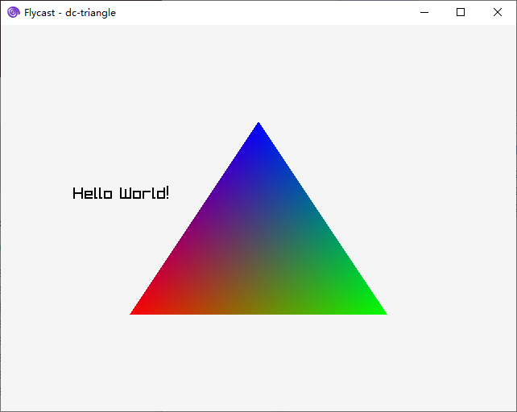

# DC_helloworld

A basic Dreamcast(DC) app

# config SDK

## DreamSDK

- Just download and install https://github.com/dreamsdk/dreamsdk/releases

## KallistiOS

- follow https://dreamcast.wiki/Getting_Started_with_Dreamcast_development

# Referencs

- https://dreamsdk.org/
- https://github.com/dreamsdk/dreamsdk
- https://github.com/KallistiOS/KallistiOS
- https://github.com/KallistiOS/kos-ports
- [flycast](https://github.com/flyinghead/flycast)
